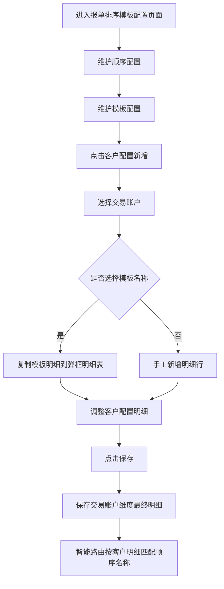

# 报单排序模板配置需求说明书

## 1、文档信息

文档标题：报单排序模板配置需求说明书  
涉及系统：BCT 系统  
编制部门：TBD  

## 2、版本修订记录

| 序号 | 文档版本 | 修订日期 | 修订人 | 修订类型 | 修订概述 | 实现版本 | 是否评审 |
| --- | --- | --- | --- | --- | --- | --- | --- |
| 1 | ver1.0 | YYYY-MM-DD | XXX | 新增 | 初稿 | BCT4.2x | 否 |

## 3、需求概述

### 3.1、需求背景

当前报单排序配置需要同时解决“配置复用”和“客户最终明细落地”两个问题。顺序配置可以定义对冲渠道的报单先后顺序，模板配置可以复用品种维度配置，但如果客户最终仅绑定模板，会导致客户最终生效配置不够直观，排查智能路由结果时需要回溯模板内容。

新版方案调整为：保留顺序配置和模板配置的复用能力，但客户配置保存时落到客户维度最终明细。模板仅作为新增客户配置时的快速填入工具，不作为客户最终保存字段。

### 3.2、需求目标

- 支持运营人员维护不同对冲渠道的报单顺序，并通过“顺序名称”复用。
- 支持运营人员维护模板配置，沉淀常用业务类型、合约类型、交易市场、资产品种、交易方向和顺序名称组合。
- 支持新增客户配置时选择模板名称快速填入模板下明细，减少重复录入。
- 支持客户配置最终保存交易账户维度明细数据，不保存模板引用关系。
- 支持智能路由执行或问题排查时，直接根据客户配置明细识别应使用的顺序名称。

### 3.3、需求范围

范围内：

- BCT 系统报单排序模板配置页面。
- 模板基础配置区域。
- 顺序配置 sheet 页：维护顺序名称、备注及对冲渠道排序。
- 模板配置 sheet 页：维护模板名称、备注及模板明细。
- 客户配置区域：展示客户最终明细配置。
- 新增客户配置弹框：选择交易账户、选择模板名称、维护明细表格并保存。
- 选择模板名称后，将模板下明细快速填入弹框表格。
- 保存客户配置后，下方客户配置列表展示最终明细。

范围外：

- 不包含对冲渠道基础资料维护。
- 不包含交易账户基础资料维护。
- 不包含模板审批、发布、版本管理。
- 不包含客户配置批量导入导出。
- 不包含智能路由执行链路、渠道可用性探测、失败重试策略改造。
- 不包含模板变更后自动同步客户配置。

### 3.4、功能列表

| 序号 | 阶段 | 版本排期 | 所属系统 | 功能模块 | 功能点 | 功能概述 | 优先级 | JIRA编号 | 备注说明 |
| --- | --- | --- | --- | --- | --- | --- | --- | --- | --- |
| 1 | 一阶段 | BCT 4.2X | BCT | 模板基础配置 | 顺序配置 | 维护顺序名称、备注、对冲渠道及报单排序 | 必须 | TBD | 保留当前排序顺序能力 |
| 2 | 一阶段 | BCT 4.2X | BCT | 模板基础配置 | 模板配置 | 通过母子表维护模板名称、备注及模板明细 | 必须 | TBD | 与顺序配置并列 sheet |
| 3 | 一阶段 | BCT 4.2X | BCT | 客户配置 | 客户配置列表 | 展示交易账户维度最终明细配置 | 必须 | TBD | 不展示模板名称字段 |
| 4 | 一阶段 | BCT 4.2X | BCT | 客户配置 | 新增客户配置 | 弹框选择交易账户、模板名称，并维护明细 | 必须 | TBD | 交易账户必填 |
| 5 | 一阶段 | BCT 4.2X | BCT | 客户配置 | 模板快速填入 | 选择模板名称后将模板明细复制到弹框明细表 | 优先 | TBD | 模板仅用于快速填入 |
| 6 | 二阶段 | BCT 4.2X+ | BCT | 客户配置 | 编辑/删除客户明细 | 支持维护已保存客户配置明细 | 一般 | TBD | 本次原型暂未重点展开 |
| 7 | 二阶段 | BCT 4.2X+ | BCT | 客户配置 | 批量导入导出 | 支持批量维护客户配置明细 | 可选 | TBD | 后续扩展 |

### 3.5、阶段实现目标

一阶段实现目标：

- 完成报单排序模板配置新版页面。
- 保留顺序配置能力，并支持渠道顺序维护。
- 新增并列 sheet“模板配置”，用于维护可复用模板明细。
- 新增客户配置弹框，支持选择模板快速填入明细。
- 客户配置保存最终明细数据，支撑智能路由按客户明细匹配顺序。

二阶段可选目标：

- 支持已保存客户配置明细的编辑、删除、复制。
- 支持客户配置批量导入、导出。
- 支持模板变更后手动刷新客户配置。
- 支持配置变更审批及版本追溯。

### 3.6、术语说明

| 术语 | 说明 |
| --- | --- |
| 顺序配置 | 定义一组对冲渠道报单先后顺序的基础配置 |
| 顺序名称 | 顺序配置的唯一名称，供模板配置和客户配置明细引用 |
| 对冲渠道 | 智能路由实际可选择的报单渠道，例如 QFII2、Mock、CMS_QFII、CMS_SC、HTSC 等 |
| 模板配置 | 用于沉淀可复用明细组合的配置，不直接代表客户最终生效结果 |
| 模板名称 | 模板配置的名称，在新增客户配置弹框中用于快速填入 |
| 模板明细 | 模板下的业务类型、合约类型、交易市场、资产品种、交易方向、顺序名称组合 |
| 客户配置 | 交易账户维度最终保存和生效的明细配置 |
| 快速填入 | 选择模板名称后，将模板明细复制到客户配置弹框明细表中 |

### 3.7、领域知识

智能路由在报单时通常需要根据交易账户、业务类型、合约类型、交易市场、资产品种、交易方向等维度匹配应使用的报单顺序。报单顺序本质上是对多个对冲渠道进行优先级排序。

新版设计将配置分为两层：基础配置层维护顺序配置和模板配置，强调复用；客户生效层维护客户配置最终明细，强调可见、可查、可用于智能路由直接匹配。

### 3.8、业务流程



### 3.9、用户分析

| 提出客户 | 用户分类 | 场景说明 |
| --- | --- | --- |
| TBD | 运营人员 | 维护顺序配置、模板配置和客户最终明细 |
| TBD | 交易运营人员 | 按业务类型、合约类型、市场、品种、方向设置报单顺序 |
| TBD | 实施人员 | 客户上线时通过模板快速初始化客户配置 |
| TBD | 运维人员 | 排查客户智能路由结果时查看最终生效明细 |

### 3.9、功能配置说明

| 序号 | 功能配置 | 产品标准开放 | 开放客户 | 初始化系统配置 | 是否兼容历史版本 | 是否需要联动其他功能 | 是否客户无感升级(单选) | 升级说明 |
| --- | --- | --- | --- | --- | --- | --- | --- | --- |
| 1 | 报单排序模板配置新版页面 | 是 | ALL | 需要初始化默认顺序配置、默认模板配置；如历史已有客户模板绑定，需要迁移为客户明细配置 | 兼容 | 按钮权限控制、交易账户基础数据、码表、对冲渠道基础数据 | 页面变动，用户使用习惯发生重大变化 | 客户配置由“绑定模板”调整为“保存最终明细” |

## 4、功能设计

### BCT系统模块

### 4.1、设计功能点一：模板基础配置 - 顺序配置

#### 功能说明

顺序配置用于维护不同对冲渠道的报单先后顺序。每个顺序配置包含顺序名称、备注和多条对冲渠道明细。顺序名称供模板配置和客户配置明细引用。

#### 界面原型

对应新版原型页面 `template-config-sheet-ui.html` 中“模板基础配置 - 顺序配置”sheet 页。

#### 字段说明

| 位置 | 序号 | 名称 | 类型 | 变更说明 | 只读 | 校验 | 校验报错信息 | 默认值 | 枚举值 | 备注 |
| --- | --- | --- | --- | --- | --- | --- | --- | --- | --- | --- |
| 顺序配置母表 | 1 | 展开按钮 | 按钮 | 新增 | 否 | 无 | 无 | 收起 | 展开、收起 | 控制子表展示 |
| 顺序配置母表 | 2 | 顺序名称 | 文本/输入 | 优化 | 否 | 必填、建议唯一 | 请输入顺序名称 | 空 | - | 供后续引用 |
| 顺序配置母表 | 3 | 备注 | 文本/输入 | 优化 | 否 | 无 | 无 | 空 | - | 描述顺序适用场景 |
| 顺序配置母表 | 4 | 操作 | 按钮 | 优化 | 否 | 删除需确认 | 无 | - | 编辑、删除 | 操作当前顺序 |
| 顺序配置子表 | 1 | 拖动块 | 拖拽控件 | 优化 | 否 | 无 | 无 | - | - | 拖拽调整排序 |
| 顺序配置子表 | 2 | 报单排序 | 数字 | 优化 | 是 | 系统计算 | 无 | 1 | - | 根据行顺序自动生成 |
| 顺序配置子表 | 3 | 对冲渠道 | 下拉/文本 | 优化 | 否 | 必填 | 请选择对冲渠道 | 空 | QFII2、Mock、CMS_QFII、CMS_SC、HTSC、CICC、IB | 枚举后续可来自渠道基础数据 |
| 顺序配置子表 | 4 | 操作 | 按钮 | 优化 | 否 | 删除需确认 | 无 | - | 删除 | 删除渠道行 |

#### 交互说明

| 位置 | 序号 | 事件 | 校验 | 校验报错信息 | 影响 | 备注 |
| --- | --- | --- | --- | --- | --- | --- |
| 顺序配置sheet | 1 | 点击“顺序配置”页签 | 无 | 无 | 展示顺序配置内容 | 与模板配置并列 |
| 顺序配置母表 | 2 | 点击展开/收起 | 无 | 无 | 展示或隐藏渠道顺序子表 | - |
| 顺序配置母表 | 3 | 点击新增 | 顺序名称后续保存必填 | 请输入顺序名称 | 新增一条顺序配置 | 默认可带空明细 |
| 顺序配置子表 | 4 | 拖动渠道行 | 仅允许同一顺序内拖动 | 无 | 调整渠道顺序并重排报单排序 | 不使用上移/下移按钮 |
| 顺序配置子表 | 5 | 点击新增一行 | 无 | 无 | 子表末尾新增渠道行 | - |
| 顺序配置子表 | 6 | 点击删除 | 删除需确认 | 无 | 删除当前渠道行 | 删除后重排报单排序 |

#### 功能逻辑

- 报单排序由渠道行在子表中的顺序决定。
- 拖拽调整后，系统自动从 1 开始重新生成报单排序。
- 顺序名称被模板配置或客户配置引用后，删除时需提示影响范围。

#### 场景示例

“权益默认顺序”下配置渠道顺序：QFII2、Mock、CMS_QFII、CMS_SC。智能路由匹配该顺序名称后，按该优先级尝试使用渠道。

#### 数据迁移

如历史系统已存在渠道顺序配置，需要迁移为新版“顺序配置”母子表结构。历史顺序名称为空时，需要生成默认顺序名称。

#### 用户故事/验收条件

作为运营人员，我希望维护不同渠道的报单顺序，以便模板配置和客户配置可以复用。

##### 4.2 用户故事详情

- 前置条件：用户具备报单排序配置权限。
- 操作步骤：进入页面，点击“顺序配置”，展开顺序并维护渠道顺序。
- 预期结果：系统保存顺序名称、备注和渠道排序。
- 异常情况：顺序名称为空时不允许保存；对冲渠道为空时不允许保存。

```gherkin
Given 用户进入报单排序模板配置页面
When 用户在顺序配置中维护渠道顺序并保存
Then 系统应保存顺序名称及对冲渠道排序
And 模板配置和客户配置明细可引用该顺序名称
```

### 4.2、设计功能点二：模板基础配置 - 模板配置

#### 功能说明

模板配置用于维护可复用的模板明细。模板配置与顺序配置在“模板基础配置”区域并列展示为两个 sheet 页。模板用于客户配置新增时快速填入，不作为客户最终保存字段。

#### 界面原型

对应新版原型页面 `template-config-sheet-ui.html` 中“模板基础配置 - 模板配置”sheet 页。

#### 字段说明

| 位置 | 序号 | 名称 | 类型 | 变更说明 | 只读 | 校验 | 校验报错信息 | 默认值 | 枚举值 | 备注 |
| --- | --- | --- | --- | --- | --- | --- | --- | --- | --- | --- |
| 模板配置母表 | 1 | 展开按钮 | 按钮 | 新增 | 否 | 无 | 无 | 收起 | 展开、收起 | 控制模板明细展示 |
| 模板配置母表 | 2 | 模板名称 | 文本/输入 | 新增 | 否 | 必填、建议唯一 | 请输入模板名称 | 空 | - | 仅用于快速填入 |
| 模板配置母表 | 3 | 备注 | 文本/输入 | 新增 | 否 | 无 | 无 | 空 | - | 描述模板适用场景 |
| 模板配置母表 | 4 | 操作 | 按钮 | 新增 | 否 | 删除需确认 | 无 | - | 编辑、删除 | 操作当前模板 |
| 模板配置子表 | 1 | 业务类型 | 下拉单选 | 新增 | 否 | 必填 | 请选择业务类型 | 普通交易 | 普通交易、空头交易、Swap交易 | - |
| 模板配置子表 | 2 | 合约类型 | 下拉单选 | 新增 | 否 | 必填 | 请选择合约类型 | 现金 | 现金、融资、融券、Swap、期货 | - |
| 模板配置子表 | 3 | 交易市场 | 下拉单选 | 新增 | 否 | 必填 | 请选择交易市场 | A股 | A股、港股、美股、境内商品、境内股指 | - |
| 模板配置子表 | 4 | 资产品种 | 下拉单选 | 新增 | 否 | 必填 | 请选择资产品种 | 股票 | 股票、可转债、ETF、商品期货、股指期货 | 当前新版原型为单选 |
| 模板配置子表 | 5 | 交易方向 | 下拉单选 | 新增 | 否 | 必填 | 请选择交易方向 | 买入 | 买入、卖出、买开、卖平、卖开、买平 | - |
| 模板配置子表 | 6 | 顺序名称 | 下拉单选 | 新增 | 否 | 必填 | 请选择顺序名称 | 空 | 来源于顺序配置 | 引用顺序配置 |
| 模板配置子表 | 7 | 操作 | 按钮 | 新增 | 否 | 删除需确认 | 无 | - | 编辑、删除 | 操作当前明细 |

#### 交互说明

| 位置 | 序号 | 事件 | 校验 | 校验报错信息 | 影响 | 备注 |
| --- | --- | --- | --- | --- | --- | --- |
| 模板配置sheet | 1 | 点击“模板配置”页签 | 无 | 无 | 展示模板配置母子表 | 与顺序配置并列 |
| 模板配置母表 | 2 | 点击展开/收起 | 无 | 无 | 展示或隐藏模板明细 | - |
| 模板配置母表 | 3 | 点击新增 | 模板名称后续保存必填 | 请输入模板名称 | 新增模板 | - |
| 模板配置母表 | 4 | 点击操作列“编辑” | 无 | 无 | 当前模板母表行进入编辑态，模板名称、备注可修改，按钮变为“保存” | 编辑期间不影响已保存客户配置 |
| 模板配置母表 | 5 | 点击操作列“保存” | 模板名称必填、建议唯一 | 请输入模板名称/模板名称已存在 | 保存模板母表字段，退出编辑态 | 若模板名称已被新增客户配置弹框选择，应刷新模板名称下拉 |
| 模板配置母表 | 6 | 点击操作列“删除” | 删除前需校验是否存在模板明细或被使用 | 当前模板存在明细，请确认是否删除 | 删除模板及其模板明细 | 不影响已通过该模板保存的客户配置明细 |
| 模板配置子表 | 7 | 点击新增一行 | 无 | 无 | 子表末尾新增明细行 | 默认可带首个枚举值 |
| 模板配置子表 | 8 | 点击操作列“编辑” | 无 | 无 | 当前模板明细行进入编辑态，业务类型、合约类型、交易市场、资产品种、交易方向、顺序名称可修改 | - |
| 模板配置子表 | 9 | 选择顺序名称 | 必须存在于顺序配置 | 请选择顺序名称 | 当前模板明细引用该顺序 | - |
| 模板配置子表 | 10 | 点击操作列“保存” | 明细必填字段完整、建议同一模板下业务维度唯一 | 请完善模板明细/当前模板下存在重复明细 | 保存当前明细行并退出编辑态 | 唯一性建议按业务类型+合约类型+交易市场+资产品种+交易方向 |
| 模板配置子表 | 11 | 点击操作列“删除” | 删除需确认 | 无 | 删除当前模板明细 | 不影响已保存客户配置 |

#### 功能逻辑

- 模板明细是一组可复用的配置组合。
- 模板名称只在新增客户配置时用于快速填入。
- 点击编辑后仅当前行进入编辑态，其他行保持只读展示。
- 点击保存时需完成必填和唯一性校验，校验通过后退出编辑态。
- 删除模板或模板明细只影响后续快速填入，不影响已保存客户配置。
- 客户配置保存后，不再依赖模板名称。
- 后续模板变更不自动影响已保存客户配置。

#### 场景示例

“权益综合模板”包含三条明细：A股股票买入使用“权益默认顺序”、A股 ETF 买入使用“权益默认顺序”、A股可转债买入使用“跨境备用顺序”。新增客户配置选择该模板后，三条明细自动填入弹框。

#### 数据迁移

如历史存在“交易账户 + 模板”绑定关系，需结合模板明细展开为客户配置明细；迁移后客户配置表不保存模板名称。

#### 用户故事/验收条件

作为运营人员，我希望维护可复用的模板配置，以便新增客户配置时快速填入明细。

##### 4.2 用户故事详情

- 前置条件：系统已存在至少一个顺序配置。
- 操作步骤：切换到“模板配置”，新增模板并维护模板明细。
- 预期结果：模板明细可被新增客户配置弹框快速填入。
- 异常情况：模板名称为空、明细必填字段为空或顺序名称不存在时不允许保存。

```gherkin
Given 系统已存在顺序配置
When 用户在模板配置中维护模板明细
Then 每条模板明细应包含业务类型、合约类型、交易市场、资产品种、交易方向、顺序名称
And 顺序名称必须来源于顺序配置
```

作为运营人员，我希望通过编辑、保存、删除按钮维护模板及模板明细，以便及时调整模板的复用内容。

##### 4.2 用户故事详情

- 前置条件：系统已存在模板配置，且用户具备模板维护权限。
- 操作步骤：点击模板母表或子表操作列“编辑”，修改字段后点击“保存”；如模板不再使用，点击“删除”。
- 预期结果：点击编辑后当前行进入编辑态；点击保存后校验通过并更新模板；点击删除后删除对应模板或明细。
- 异常情况：模板名称为空、明细字段不完整、同一模板下业务维度重复时不允许保存；删除被引用模板时需提示不影响已保存客户配置。

```gherkin
Given 用户正在查看模板配置母子表
When 用户点击某条模板明细操作列的“编辑”
Then 当前明细行应进入编辑态
When 用户修改字段后点击“保存”
Then 系统应校验必填字段和唯一性
And 校验通过后保存明细并退出编辑态
When 用户点击“删除”
Then 系统应提示确认并删除该模板明细
And 已保存客户配置明细不应被自动修改
```

### 4.3、设计功能点三：客户配置列表

#### 功能说明

客户配置列表展示交易账户维度最终保存的智能路由明细。列表不展示模板名称，因为模板只用于快速填入，不作为最终保存数据。

#### 界面原型

对应新版原型页面 `template-config-sheet-ui.html` 中“客户配置”区域。

#### 字段说明

| 位置 | 序号 | 名称 | 类型 | 变更说明 | 只读 | 校验 | 校验报错信息 | 默认值 | 枚举值 | 备注 |
| --- | --- | --- | --- | --- | --- | --- | --- | --- | --- | --- |
| 客户配置列表 | 1 | 交易账户 | 文本 | 优化 | 是 | 必填 | 请选择交易账户 | 空 | 来源于交易账户基础数据 | 最终保存字段 |
| 客户配置列表 | 2 | 业务类型 | 文本 | 新增 | 是 | 必填 | 请选择业务类型 | 空 | 普通交易、空头交易、Swap交易 | 最终保存字段 |
| 客户配置列表 | 3 | 合约类型 | 文本 | 新增 | 是 | 必填 | 请选择合约类型 | 空 | 现金、融资、融券、Swap、期货 | 最终保存字段 |
| 客户配置列表 | 4 | 交易市场 | 文本 | 新增 | 是 | 必填 | 请选择交易市场 | 空 | A股、港股、美股、境内商品、境内股指 | 最终保存字段 |
| 客户配置列表 | 5 | 资产品种 | 文本 | 新增 | 是 | 必填 | 请选择资产品种 | 空 | 股票、可转债、ETF、商品期货、股指期货 | 最终保存字段 |
| 客户配置列表 | 6 | 交易方向 | 文本 | 新增 | 是 | 必填 | 请选择交易方向 | 空 | 买入、卖出、买开、卖平、卖开、买平 | 最终保存字段 |
| 客户配置列表 | 7 | 顺序名称 | 文本 | 新增 | 是 | 必填 | 请选择顺序名称 | 空 | 来源于顺序配置 | 最终保存字段 |
| 新增客户配置弹框顶部 | 8 | 交易账户 | 下拉单选 | 新增 | 否 | 必填 | 请选择交易账户 | 请选择 | 来源于交易账户基础数据 | 保存时统一带入明细 |
| 新增客户配置弹框顶部 | 9 | 模板名称 | 下拉单选 | 新增 | 否 | 非必填 | 无 | 请选择 | 来源于模板配置 | 仅用于快速填入，不保存 |
| 新增客户配置弹框明细表 | 10 | 业务类型 | 下拉单选 | 新增 | 否 | 必填 | 请选择业务类型 | 普通交易 | 普通交易、空头交易、Swap交易 | 明细表不包含交易账户列 |
| 新增客户配置弹框明细表 | 11 | 合约类型 | 下拉单选 | 新增 | 否 | 必填 | 请选择合约类型 | 现金 | 现金、融资、融券、Swap、期货 | - |
| 新增客户配置弹框明细表 | 12 | 交易市场 | 下拉单选 | 新增 | 否 | 必填 | 请选择交易市场 | A股 | A股、港股、美股、境内商品、境内股指 | - |
| 新增客户配置弹框明细表 | 13 | 资产品种 | 下拉单选 | 新增 | 否 | 必填 | 请选择资产品种 | 股票 | 股票、可转债、ETF、商品期货、股指期货 | - |
| 新增客户配置弹框明细表 | 14 | 交易方向 | 下拉单选 | 新增 | 否 | 必填 | 请选择交易方向 | 买入 | 买入、卖出、买开、卖平、卖开、买平 | - |
| 新增客户配置弹框明细表 | 15 | 顺序名称 | 下拉单选 | 新增 | 否 | 必填 | 请选择顺序名称 | 空 | 来源于顺序配置 | - |
| 新增客户配置弹框明细表 | 16 | 操作 | 按钮 | 新增 | 否 | 删除需确认 | 无 | - | 删除 | 删除当前明细行 |
| 新增客户配置弹框底部 | 17 | 新增一行 | 按钮 | 新增 | 否 | 无 | 无 | - | - | 在明细表末尾新增空行 |
| 新增客户配置弹框底部 | 18 | 取消 | 按钮 | 新增 | 否 | 无 | 无 | - | - | 关闭弹框，不保存 |
| 新增客户配置弹框底部 | 19 | 保存 | 按钮 | 新增 | 否 | 交易账户必填、至少一条明细 | 请选择交易账户/请至少新增一条明细 | - | - | 保存最终明细 |

#### 交互说明

| 位置 | 序号 | 事件 | 校验 | 校验报错信息 | 影响 | 备注 |
| --- | --- | --- | --- | --- | --- | --- |
| 客户配置区域 | 1 | 点击新增 | 无 | 无 | 打开新增客户配置弹框 | - |
| 新增客户配置弹框顶部 | 2 | 选择交易账户 | 必填 | 请选择交易账户 | 保存时将该账户统一带入所有明细 | 明细表不展示交易账户列 |
| 新增客户配置弹框顶部 | 3 | 选择模板名称 | 无 | 无 | 将模板下明细复制到弹框明细表 | 模板名称仅用于快速填入，不保存 |
| 新增客户配置弹框明细表 | 4 | 点击新增一行 | 无 | 无 | 新增一条可编辑明细 | 可不选择模板手工新增 |
| 新增客户配置弹框明细表 | 5 | 修改明细字段 | 明细字段需在枚举范围内 | 请完善客户配置明细 | 更新弹框内待保存明细 | 保存前不影响下方列表 |
| 新增客户配置弹框明细表 | 6 | 点击删除 | 删除需确认 | 无 | 删除当前明细行 | 若删除后明细为空，保存时提示至少一条明细 |
| 新增客户配置弹框底部 | 7 | 点击取消/关闭 | 无 | 无 | 关闭弹框，不保存本次数据 | 弹框内临时明细清空 |
| 新增客户配置弹框底部 | 8 | 点击保存 | 交易账户必填、明细不为空、明细字段完整、建议唯一性校验 | 请选择交易账户/请完善客户配置明细/当前交易账户下存在重复配置 | 将交易账户与弹框明细组合后写入客户配置列表 | 保存的是最终明细数据，不保存模板名称 |
| 客户配置列表 | 9 | 保存成功后刷新 | 无 | 无 | 展示新增的客户配置明细 | 不展示模板名称 |

#### 功能逻辑

- 客户配置列表中的数据为最终生效数据。
- 智能路由匹配时，应使用交易账户、业务类型、合约类型、交易市场、资产品种、交易方向匹配顺序名称。
- 建议同一交易账户下，“业务类型 + 合约类型 + 交易市场 + 资产品种 + 交易方向”唯一。
- 新增客户配置弹框中的模板名称仅用于快速填入弹框明细表。
- 弹框明细表不展示交易账户列，保存时由弹框顶部交易账户统一带入。
- 选择模板填入后，用户仍可新增、删除、修改明细。
- 模板后续变更不自动影响已保存客户配置明细。

#### 场景示例

交易账户 T10000011，普通交易，现金，A股，股票，买入，对应顺序名称为“权益默认顺序”。当该账户发起 A股股票买入报单时，智能路由使用“权益默认顺序”对应渠道排序。

新增客户配置时，用户选择交易账户 T10000011，再选择“权益综合模板”。系统将模板下 A股股票买入、A股 ETF 买入、A股可转债买入等明细填入弹框。用户删除不适用明细后点击保存，客户配置列表新增该账户对应的最终明细。

#### 数据迁移

历史客户模板绑定数据需展开为客户配置明细。例如客户绑定“权益综合模板”，迁移时读取该模板下全部明细，为该客户生成多条最终明细。

#### 用户故事/验收条件

作为运维人员，我希望直接查看客户最终明细配置，以便排查客户智能路由使用的顺序。

##### 4.2 用户故事详情

- 前置条件：系统已存在客户配置明细。
- 操作步骤：进入页面查看客户配置列表。
- 预期结果：列表展示交易账户及各业务维度对应顺序名称。
- 异常情况：无数据时展示空列表。

```gherkin
Given 系统已保存客户配置明细
When 用户查看客户配置列表
Then 系统应展示交易账户、业务类型、合约类型、交易市场、资产品种、交易方向、顺序名称
And 列表不应展示模板名称字段
```

作为运营人员，我希望通过模板快速新增客户配置明细，以便减少重复录入并保证最终配置可核对。

##### 4.2 用户故事详情

- 前置条件：系统已维护交易账户、顺序配置和模板配置。
- 操作步骤：点击客户配置新增，选择交易账户，选择模板名称，确认或调整明细后保存。
- 预期结果：客户配置列表新增所选交易账户对应的最终明细，且不保存模板名称。
- 异常情况：未选择交易账户、明细为空、明细字段不完整或重复时不允许保存。

```gherkin
Given 系统已存在模板配置和顺序配置
When 用户在新增客户配置弹框中选择交易账户并选择模板名称
Then 系统应将模板明细填入弹框明细表
And 弹框明细表不展示交易账户列
When 用户点击保存
Then 系统应保存交易账户维度最终明细
And 客户配置列表不展示模板名称字段
```

作为交易运营人员，我希望在模板填入后继续调整客户明细，以便处理客户个性化路由要求。

##### 4.2 用户故事详情

- 前置条件：弹框已根据模板填入明细。
- 操作步骤：删除不适用明细，新增客户个性化明细，调整顺序名称后保存。
- 预期结果：客户配置列表保存调整后的最终明细，而不是原模板完整明细。
- 异常情况：调整后出现重复业务维度时不允许保存。

```gherkin
Given 用户已通过模板名称快速填入客户配置明细
When 用户删除部分明细并新增个性化明细后点击保存
Then 系统应保存用户调整后的最终明细
And 不应强制保存模板原始完整明细
```

### APP系统模块

本次需求不涉及 APP 系统模块。

### OMS系统模块

本次需求不涉及 OMS 系统模块。

## 5、非功能性要求(或有)

运行环境需求：

- 支持 BCT 系统当前浏览器兼容范围。
- 页面需适配 BCT 系统现有菜单、权限、布局规范。

性能需求：

- 顺序配置、模板配置、客户配置列表在 500 条明细以内，展开、切换、保存应保持流畅。
- 模板快速填入 100 条明细以内，前端填充耗时应不超过 1 秒。
- 保存客户配置时，前后端均需进行必填和重复性校验。

可靠性需求：

- 保存失败时需保留用户当前弹框输入内容，不应直接清空。
- 删除顺序配置或模板配置时，如已被引用，需提示影响范围。
- 客户配置保存成功后，应刷新列表并展示最新明细。

## 6、依赖与限制(或有)

依赖项：

- 交易账户基础数据。
- 对冲渠道基础数据。
- 业务类型码表。
- 合约类型码表。
- 交易市场码表。
- 资产品种码表。
- 交易方向码表。
- 顺序配置查询、保存、删除接口。
- 模板配置查询、保存、删除接口。
- 客户配置明细查询、保存、删除接口。
- BCT 按钮权限控制。

## 7、局限说明 (或有)

| 序号 | 局限说明 | 说明人 | 备注 |
| --- | --- | --- | --- |
| 1 | 本次原型重点覆盖新增客户配置，未完整展开客户配置编辑、删除、批量维护能力 | XXX | 后续二阶段补充 |
| 2 | 模板变更后不自动同步已保存客户配置 | XXX | 避免历史客户配置被意外覆盖 |
| 3 | 当前新版原型中资产品种为单选 | XXX | 如业务要求多选，保存时需拆分为多条明细 |
| 4 | 本次不包含审批、发布、版本追溯 | XXX | 后续可作为配置治理能力补充 |

## 8、待确定问题(或有)

| 序号 | 需求问题 | 提出人 | 跟进人 | 完成状态 | 问题结论 | 备注 |
| --- | --- | --- | --- | --- | --- | --- |
| 1 | 同一交易账户下客户配置唯一性是否按“业务类型 + 合约类型 + 交易市场 + 资产品种 + 交易方向”判断 | XXX | TBD | 待确认 | 建议按该组合唯一，不包含顺序名称 | 防止同一场景命中多个顺序 |
| 2 | 模板明细中的资产品种是否需要支持多选 | XXX | TBD | 待确认 | 当前原型为单选 | 多选需保存时拆分 |
| 3 | 客户配置是否需要支持编辑、删除和批量删除 | XXX | TBD | 待确认 | 建议二阶段补充 | 当前原型仅强调新增 |
| 4 | 是否需要提供“按模板刷新客户配置”能力 | XXX | TBD | 待确认 | 当前不自动刷新 | 如需要需单独设计 |
| 5 | 历史客户模板绑定迁移为客户明细时，是否需要保留原模板名称作为审计字段 | XXX | TBD | 待确认 | 建议后台审计保留，前台列表不展示 | 便于追溯 |

## 9、附录(或有)

参考资料：

- 新版 UI 原型：`template-config-sheet-ui.html`
- 历史 PRD：`PRD.md`
- 历史 HTML PRD：`PRD.html`
