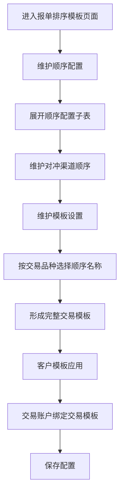

# 报单排序模板配置 PRD

## 1、文档信息

文档标题：报单排序模板配置需求说明书  
涉及系统：BCT 系统  
编制部门：TBD  

## 2、版本修订记录

| 序号 | 文档版本 | 修订日期 | 修订人 | 修订类型 | 修订概述 | 实现版本 | 是否评审 |
| --- | --- | --- | --- | --- | --- | --- | --- |
| 1 | ver1.0 | YYYY-MM-DD | XXX | 新增 | 初稿，基于三段式页面原型描述顺序配置、模板设置、客户模板应用 | BCT 4.2X | 否 |

## 3、需求概述

### 3.1、需求背景

当前报单排序逻辑需要同时解决三个层级的问题：首先，不同对冲渠道需要有不同的报单先后顺序；其次，不同交易品种需要选择适用的渠道顺序，并组合成完整交易模板；最后，客户交易账户需要绑定最终应用的交易模板。

如果直接在客户账户维度维护所有品种和渠道顺序，会导致配置重复、维护成本高，并且难以复用。因此本次将报单排序配置拆为三层：顺序配置、模板设置、客户模板应用。

### 3.2、需求目标

- 支持维护多个渠道顺序，每个渠道顺序有独立“顺序名称”。
- 支持在渠道顺序内维护对冲渠道排序，并通过拖动块调整顺序。
- 支持将多个品种配置拼装为一个交易模板。
- 支持交易模板中的每条品种配置引用已维护的顺序名称。
- 支持客户交易账户绑定最终应用的交易模板。
- 支持客户模板应用按交易账户查询和重置。
- 降低重复配置，提高渠道顺序和交易模板的复用能力。

### 3.3、需求范围

范围内：

- BCT 系统新增或优化“报单排序模板”页面。
- 页面包含三个模块：顺序配置、模板设置、客户模板应用。
- 顺序配置支持新增、展开/收起、编辑、保存、删除。
- 顺序配置子表支持新增一行、删除、修改对冲渠道、拖动排序。
- 模板设置支持新增、展开/收起、编辑、保存、删除。
- 模板设置子表支持新增一行、编辑、保存、删除。
- 模板设置子表交易品种支持下拉多选编辑。
- 客户模板应用支持新增、删除、修改交易账户、选择交易模板。
- 客户模板应用支持按交易账户筛选查询和重置。

范围外：

- 不包含渠道基础资料维护。
- 不包含交易模板审批流程。
- 不包含报单执行链路改造。
- 不包含渠道健康度、可用性、失败重试策略。
- 不包含不同客户权限的完整权限模型设计，仅预留按钮权限控制。

### 3.4、功能列表

| 序号 | 阶段 | 版本排期 | 所属系统 | 功能模块 | 功能点 | 功能概述 | 优先级 | JIRA编号 | 备注说明 |
| --- | --- | --- | --- | --- | --- | --- | --- | --- | --- |
| 1 | 一阶段 | BCT 4.2X | BCT | 顺序配置 | 顺序模板维护 | 维护顺序名称、备注及顺序模板列表 | 必须 | TBD | 第一层配置 |
| 2 | 一阶段 | BCT 4.2X | BCT | 顺序配置 | 渠道顺序明细 | 展开顺序模板后维护报单排序和对冲渠道 | 必须 | TBD | 支持拖动块排序 |
| 3 | 一阶段 | BCT 4.2X | BCT | 模板设置 | 交易模板维护 | 维护交易模板名称、备注及模板列表 | 必须 | TBD | 第二层配置 |
| 4 | 一阶段 | BCT 4.2X | BCT | 模板设置 | 品种配置明细 | 按交易类型、交易市场、交易品种、交易方向引用顺序名称 | 必须 | TBD | 交易品种支持多选 |
| 5 | 一阶段 | BCT 4.2X | BCT | 客户模板应用 | 账户模板绑定 | 维护交易账户与交易模板绑定关系 | 必须 | TBD | 第三层配置 |
| 6 | 一阶段 | BCT 4.2X | BCT | 客户模板应用 | 账户筛选查询 | 支持按交易账户查询、重置 | 优先 | TBD | 用于快速定位客户绑定 |

### 3.5、阶段实现目标

一阶段实现目标：

- 完成三段式报单排序配置页面。
- 支持顺序配置复用。
- 支持交易模板按品种拼装。
- 支持客户交易账户绑定交易模板。
- 支持基础增删改查交互。

### 3.6、术语说明

| 术语 | 说明 |
| --- | --- |
| 顺序配置 | 第一层配置，用于定义一组对冲渠道的报单先后顺序 |
| 顺序名称 | 顺序配置的名称，供模板设置引用 |
| 对冲渠道 | 报单可选择的渠道，例如 QFII2、Mock、CMS_QFII、CMS_SC、HTSC 等 |
| 模板设置 | 第二层配置，用多个品种配置拼装成完整交易模板 |
| 交易模板 | 可被客户交易账户绑定使用的完整模板 |
| 客户模板应用 | 第三层配置，用于维护交易账户与交易模板的绑定关系 |
| 交易市场 | 品种配置字段，表示交易市场，当前原型包括 A股、港股、美股、境内商品、境内股指、境外期货 |
| 交易品种 | 品种配置字段，支持多选，例如股票、可转债、ETF、商品期货、股指期货 |

### 3.7、领域知识

报单排序通常需要区分渠道层、品种层、客户层。通过分层设计，可以避免每个客户重复维护渠道顺序，也能让渠道顺序变更后被多个模板复用。

### 3.8、业务流程

### 3.9、用户分析

| 提出客户 | 用户分类 | 场景说明 |
| --- | --- | --- |
| TBD | 系统管理员 | 维护渠道顺序、交易模板及客户绑定关系 |
| TBD | 交易运营人员 | 根据交易市场、品种和方向配置适用的报单顺序 |
| TBD | 实施/运维人员 | 客户上线或配置初始化时批量维护默认模板 |

### 3.10、功能配置说明

| 序号 | 功能配置 | 产品标准开放 | 开放客户 | 初始化系统配置 | 是否兼容历史版本 | 是否需要联动其他功能 | 是否客户无感升级 | 升级说明 |
| --- | --- | --- | --- | --- | --- | --- | --- | --- |
| 1 | 报单排序三段式配置 | 是 | ALL | 需初始化默认顺序配置、默认交易模板及客户默认绑定关系 | 兼容 | 按钮权限、交易账户、交易市场、交易品种、对冲渠道基础数据 | 页面变动，用户使用习惯发生较大变化 | 由账户直接配置调整为顺序配置、模板设置、客户模板应用三层配置 |

## 4、功能设计

### 4.1、设计功能点一：顺序配置

#### 功能说明

顺序配置用于维护不同对冲渠道的报单顺序。每个顺序配置有一个“顺序名称”，可被模板设置模块引用。

#### 字段说明

| 位置 | 序号 | 名称 | 类型 | 变更说明 | 只读 | 校验 | 校验报错信息 | 默认值 | 枚举值 | 备注 |
| --- | --- | --- | --- | --- | --- | --- | --- | --- | --- | --- |
| 顺序配置母表 | 1 | 展开按钮 | 按钮 | 新增 | 否 | 无 | 无 | 收起 | 展开/收起 | 控制子表展示 |
| 顺序配置母表 | 2 | 顺序名称 | 输入/文本 | 新增 | 否 | 必填、建议唯一 | 请输入顺序名称 | 空 | - | 被模板设置引用 |
| 顺序配置母表 | 3 | 备注 | 输入/文本 | 新增 | 否 | 无 | 无 | 空 | - | 描述顺序用途 |
| 顺序配置母表 | 4 | 操作 | 按钮 | 新增 | 否 | 删除确认 | 无 | - | 编辑、保存、删除 | 编辑态按钮改为保存 |
| 顺序配置子表 | 1 | 拖动块 | 图标/拖动柄 | 新增 | 否 | 无 | 无 | - | - | 使用左侧拖动块调整顺序 |
| 顺序配置子表 | 2 | 报单排序 | 数字 | 新增 | 是 | 系统计算 | 无 | 1 | - | 拖拽后自动重排 |
| 顺序配置子表 | 3 | 对冲渠道 | 下拉单选 | 新增 | 否 | 必填 | 请选择对冲渠道 | 空 | QFII2、Mock、CMS_QFII、CMS_SC、HTSC、CICC、IB | 渠道枚举后续可来自码表 |
| 顺序配置子表 | 4 | 操作 | 按钮 | 新增 | 否 | 删除确认 | 无 | - | 删除 | 不提供上移/下移按钮 |

#### 交互说明

| 位置 | 序号 | 事件 | 校验 | 校验报错信息 | 影响 | 备注 |
| --- | --- | --- | --- | --- | --- | --- |
| 顺序配置母表 | 1 | 点击新增 | 无 | 无 | 新增一个顺序配置，并默认带一条渠道明细 | 新增后默认展开 |
| 顺序配置母表 | 2 | 点击展开/收起 | 无 | 无 | 展示或隐藏渠道顺序子表 | - |
| 顺序配置母表 | 3 | 点击编辑 | 无 | 无 | 顺序名称、备注切换为输入框，按钮变为保存 | 编辑态所有字符可修改 |
| 顺序配置母表 | 4 | 点击保存 | 顺序名称必填 | 请输入顺序名称 | 保存母表字段，退出编辑态 | 建议后端校验顺序名称唯一 |
| 顺序配置子表 | 1 | 拖动左侧拖动块 | 无 | 无 | 调整渠道顺序，报单排序自动重排 | 删除上移/下移按钮 |

### 4.2、设计功能点二：模板设置

#### 功能说明

模板设置用于将多个品种配置拼装成一个完整交易模板。每个品种配置根据交易类型、交易市场、交易品种、交易方向选择适用的顺序名称。

#### 字段说明

| 位置 | 序号 | 名称 | 类型 | 变更说明 | 只读 | 校验 | 校验报错信息 | 默认值 | 枚举值 | 备注 |
| --- | --- | --- | --- | --- | --- | --- | --- | --- | --- | --- |
| 模板设置母表 | 1 | 交易模板名称 | 输入/文本 | 新增 | 否 | 必填、建议唯一 | 请输入交易模板名称 | 空 | - | 客户模板应用引用 |
| 模板设置母表 | 2 | 备注 | 输入/文本 | 新增 | 否 | 无 | 无 | 空 | - | 描述模板适用场景 |
| 模板设置子表 | 1 | 交易类型 | 下拉单选 | 新增 | 否 | 必填 | 请选择交易类型 | 普通交易 | 普通交易、空头交易 | - |
| 模板设置子表 | 2 | 交易市场 | 下拉单选 | 新增 | 否 | 必填 | 请选择交易市场 | A股 | A股、港股、美股、境内商品、境内股指、境外期货 | 后续可来自码表 |
| 模板设置子表 | 3 | 交易品种 | 下拉多选 | 新增 | 否 | 至少选择一个 | 请选择交易品种 | 股票 | 股票、可转债、ETF、商品期货、股指期货 | 编辑态可多选 |
| 模板设置子表 | 4 | 交易方向 | 下拉单选 | 新增 | 否 | 必填 | 请选择交易方向 | 买入 | 买入、卖出、买开、卖平、卖开、买平 | - |
| 模板设置子表 | 5 | 顺序名称 | 下拉单选 | 新增 | 否 | 必填 | 请选择顺序名称 | 空 | 来源于顺序配置 | 引用第一模块顺序名称 |

#### 交互说明

| 位置 | 序号 | 事件 | 校验 | 校验报错信息 | 影响 | 备注 |
| --- | --- | --- | --- | --- | --- | --- |
| 模板设置母表 | 1 | 点击编辑 | 无 | 无 | 交易模板名称、备注切换为输入框，按钮变保存 | 编辑态所有字符可修改 |
| 模板设置子表 | 1 | 点击编辑 | 无 | 无 | 当前行全部字段进入编辑态，按钮变保存 | 交易品种为下拉多选 |
| 模板设置子表 | 2 | 点击新增一行 | 无 | 无 | 子表末尾新增一条默认品种配置 | 默认引用第一个顺序名称 |

### 4.3、设计功能点三：客户模板应用

#### 功能说明

客户模板应用用于维护交易账户与交易模板之间的绑定关系。

#### 字段说明

| 位置 | 序号 | 名称 | 类型 | 变更说明 | 只读 | 校验 | 校验报错信息 | 默认值 | 枚举值 | 备注 |
| --- | --- | --- | --- | --- | --- | --- | --- | --- | --- | --- |
| 筛选区 | 1 | 交易账户 | 下拉单选 | 新增 | 否 | 无 | 无 | 请选择 | 来自已绑定交易账户 | 用于筛选绑定关系 |
| 筛选区 | 2 | 查询 | 按钮 | 新增 | 否 | 无 | 无 | - | - | 按交易账户过滤列表 |
| 筛选区 | 3 | 重置 | 按钮 | 新增 | 否 | 无 | 无 | - | - | 清空筛选并展示全部 |
| 客户模板应用列表 | 1 | 交易账户 | 输入/文本 | 新增 | 否 | 必填 | 请输入交易账户 | 空 | 交易账户基础数据 | 当前原型可输入 |
| 客户模板应用列表 | 2 | 交易模板 | 下拉单选 | 新增 | 否 | 必填 | 请选择交易模板 | 空 | 来源于模板设置 | 绑定最终应用模板 |

#### 交互说明

| 位置 | 序号 | 事件 | 校验 | 校验报错信息 | 影响 | 备注 |
| --- | --- | --- | --- | --- | --- | --- |
| 筛选区 | 1 | 选择交易账户并点击查询 | 无 | 无 | 仅展示该交易账户绑定关系 | 未选择时可展示全部 |
| 筛选区 | 2 | 点击重置 | 无 | 无 | 清空筛选条件，展示全部绑定关系 | - |
| 列表 | 1 | 点击新增 | 无 | 无 | 新增一条空绑定行 | 交易模板默认取第一个模板 |

## 5、非功能性要求

- 支持 BCT 系统当前浏览器兼容范围。
- 顺序配置、模板设置、客户模板应用列表在 500 条以内时，展开、编辑、拖动排序应保持流畅。
- 前端拖拽排序后应即时刷新排序号。
- 保存时后端需进行数据一致性校验。

## 6、依赖与限制

- 对冲渠道基础数据。
- 交易市场基础数据。
- 交易品种基础数据。
- 交易账户基础数据。
- 按钮权限控制。
- 配置查询、保存、删除接口。

## 7、局限说明

| 序号 | 局限说明 | 说明人 | 备注 |
| --- | --- | --- | --- |
| 1 | 当前 PRD 基于前端原型整理，接口字段和数据库模型需技术方案进一步确认 | XXX | TBD |
| 2 | 当前原型允许交易账户手工输入，最终是否改为下拉选择待确认 | XXX | TBD |
| 3 | 顺序配置被模板引用时的删除策略需确认 | XXX | 建议阻止删除 |

## 8、待确定问题

| 序号 | 需求问题 | 提出人 | 跟进人 | 完成状态 | 问题结论 | 备注 |
| --- | --- | --- | --- | --- | --- | --- |
| 1 | 顺序名称是否需要全局唯一 | XXX | TBD | 待确认 | TBD | 影响模板引用 |
| 2 | 交易模板名称是否需要全局唯一 | XXX | TBD | 待确认 | TBD | 影响客户绑定 |
| 3 | 一个交易账户是否只允许绑定一个交易模板 | XXX | TBD | 待确认 | TBD | 建议唯一 |
| 4 | 拖拽排序后是否立即保存，还是点击统一保存 | XXX | TBD | 待确认 | TBD | 当前原型为即时变更 |

## 9、附录

- 当前前端 Demo：`order-template-demo/index.html`
- 当前交互脚本：`order-template-demo/app.js`
- 网页版 PRD：`order-template-demo/PRD.html`
